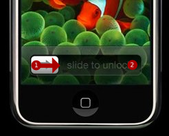

# How to Unlock Your iPhone Faster {#how-to-unlock-your-iphone-faster}

2007-07-13

If you have two fingers or a godlike thumb you can unlock your iPhone
faster.

Put your human skin at the 1 position and move it ever so slightly to
the right (the less you move it the better). Then press the 2 position
with your skin.

This operation, if done correctly, takes less time than sliding your
finger along the interface.

Any other gesture saving tips?
